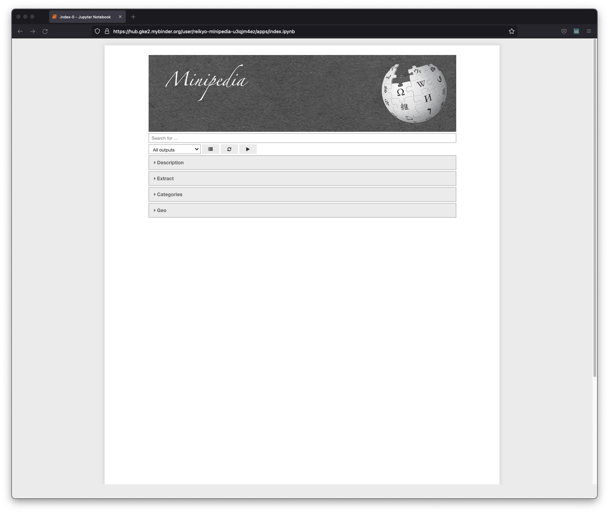
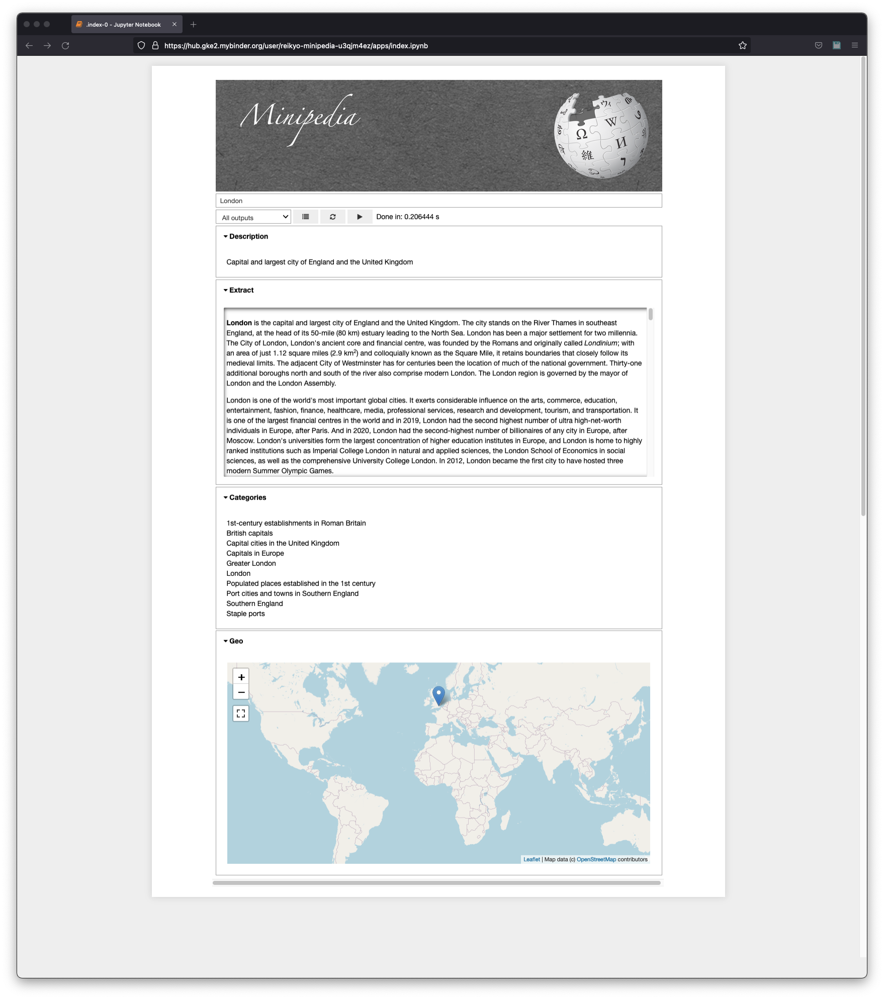

# Minipedia

This Python code calls the English language [Wikipedia](https://en.wikipedia.org) for a given search request, wrapped up as a standalone web application for automated launch in a headless (i.e. hidden controls) Jupyter notebook via a [Binder](https://mybinder.org) virtual machine. Just click the launch button at the top of this page, and a VM will be spun up with all necessary dependencies ready to go. This should only take a couple of minutes, but it depends on the current usage of the Binder service. Note that once loaded, the application will time out after a couple of minutes of inactivity, and the link cannot be refreshed. You will need to start again by launching a new instance via the button at the top of this page.

Once the VM is ready, you will be presented with a simple graphical user interface in the browser for inputting your search request, sending it to Wikipedia, and seeing the various outputs as detailed below.

The main reason for this project is simply to illustrate the basics of the Wikipedia API and making such a browser application with Jupyter, by inspecting and downloading the files and running locally. This is useful for anyone that needs to access Wikipedia programatically. If you don't, then there really isn't anything here that's useful for you. If you need to know something from Wikipedia ... then just visit Wikipedia :kissing_smiling_eyes:

---

## Outputs

  
 

The above images show the running application. The first image show the empty GUI as it appears on launch, and the second image shows the outputs for a processed search request. There are four output sections:

- Description - A short description
- Extract - A long description
- Categories - The categories as usually found at the bottom of the Wikipedia article
- Geo - The location on a map, if relevant
